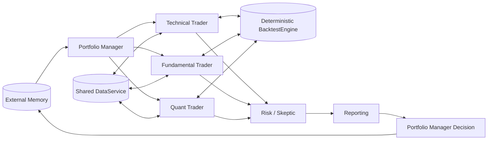

# Planned System Architecture

Status: placeholder scaffold

Architecture date: 2026-07-26

## Architectural classification

| Component | Kind | Hireable |
|---|---|---:|
| Portfolio Manager | Human management boundary | No |
| Technical Trader | Specialist | Yes |
| Fundamental Trader | Specialist | Yes |
| Quant Trader | Specialist | Yes |
| Risk / Skeptic | Specialist | Yes |
| Reporting | Specialist | Yes |
| DataService | Shared infrastructure | No |
| BacktestEngine | Shared deterministic tool | No |
| MemoryStore | External service | No |

## Trader branches

The three traders run independently and may use separate LLMs. They receive the
same PM mandate but plan different data requests and generate different
strategies. All produce the same package type and call the same Data and
Backtest boundaries.

Technical Trader integration must eventually adapt the separately developed
`project_agents/technical_trader_agent` package. Fundamental and Quant remain
teammate-owned placeholders.

## Join and partial-result semantics

The graph waits until all hired trader branches have completed, failed, timed
out, or been cancelled. Successful packages and excluded failures are preserved
together. One failed trader cannot erase another trader's candidate.

Risk then reviews the batch collectively, including selection bias across
candidates. Reporting receives only approved candidates. Zero survivors is a
valid outcome and still requires a PM-facing result.

## PM outcomes

- no surviving candidate;
- one surviving candidate;
- multiple surviving candidates requiring PM selection.

No strategy-combination path exists.

## Memory

Memory stores results, critiques, PM decisions, and lessons. A later round may
load those lessons into controlled PM/graph context. Memory cannot alter an
existing backtest result or bypass the deterministic engine.

## Graph compatibility

`src/graph/workflow.py` is a declarative blueprint, not LangGraph code. Its node
identities, state fields, routing functions, and join semantics can be mapped to
LangGraph after the workflow owners confirm final state serialization and
reducers.

[ADR 0001](adr/0001-langgraph-tooling.md) confirms the LangGraph 1.2
major-compatible Graph API for tooling. Arturo's separately developed Technical
Trader package includes an optional single-node compatibility adapter. This
does not implement or replace the production workflow assigned to Emma and
Shaurya.
